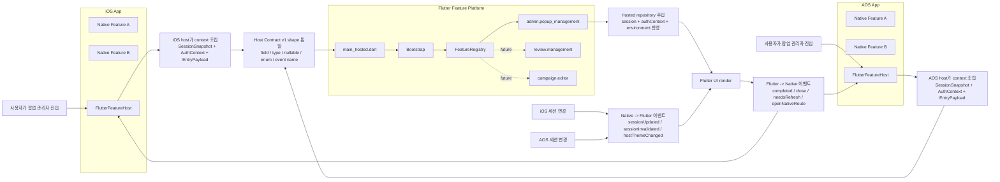

# PopPang-Flutter

`PopPang-Flutter`는 PopPang iOS/Android 앱이 공통으로 임베드해 사용할 Flutter feature 저장소예요.
첫 번째 목표는 팝업 관리자 화면을 Flutter로 구현해 두 플랫폼에서 함께 쓰는 것이에요.

이 저장소는 PopPang 전체 앱을 Flutter로 다시 만드는 프로젝트가 아니에요.
네이티브 앱이 계속 앱 레벨 책임을 갖고, Flutter는 재사용 가능한 feature 계층을 맡아요.

> 현재 이 저장소는 스캐폴딩 단계예요.
> 아직 실행 가능한 Flutter 앱 코드는 없고, README와 placeholder 디렉터리만 커밋돼 있어요.
> 그래서 이 문서는 "지금 바로 실행하는 방법"보다 "무엇을 만들고 어떻게 연결할지"를 설명하는 설계 문서에 가까워요.

## 한눈에 보기

- 이 저장소는 PopPang 네이티브 앱용 공용 Flutter feature 플랫폼이에요.
- 첫 번째 공개 feature ID는 `admin.popup_management`예요.
- 앱 세션, 앱 전역 네비게이션, 네이티브 SDK, 배포 책임은 계속 네이티브가 가져가요.
- Flutter feature는 hosted mode와 demo mode에서 같은 코드를 써요.
- v1에서는 Flutter repository가 관리자 API를 직접 호출할 수 있어요.
- 최종 권한 검증 책임은 서버가 가져가요.

## 현재 상태

현재 저장소에는 아래 디렉터리만 준비돼 있어요.

```text
PopPang-Flutter/
├─ README.md
├─ integration_test/
├─ lib/
├─ pigeon/
├─ scripts/
└─ test/
```

아직 아래 항목은 커밋되지 않았어요.

- `pubspec.yaml`
- `lib/main_demo.dart`
- `lib/main_hosted.dart`
- 실제 feature 코드
- host bridge 구현

문서 안에서 나오는 파일 구조와 진입점은 "현재 상태"가 아니라 "목표 구조"로 읽으면 돼요.

## 이번 범위

### 목표

- 팝업 관리자 feature를 Flutter로 한 번만 구현하고 iOS/Android에서 함께 사용해요.
- 네이티브 앱이 Flutter feature를 실행하고 세션을 전달하고 결과를 받는 공용 계약을 만들어요.
- 같은 feature 코드를 유지한 채 hosted mode와 demo mode를 함께 지원해요.
- 이후 다른 feature도 같은 방식으로 추가할 수 있는 구조를 만들어요.

### 하지 않는 일

- PopPang 전체 앱을 Flutter로 전환하지 않아요.
- 앱 루트 네비게이션 소유권을 네이티브에서 Flutter로 옮기지 않아요.
- 첫 번째 마이그레이션에서 인증 체계나 API 계약을 전면 개편하지 않아요.
- 모든 기능을 한 번에 Flutter로 옮기지 않아요.

### 아직 미정인 것

- iOS artifact를 어떤 포맷과 경로로 고정할지
- Android AAR 배포 저장소와 릴리즈 자동화 방식
- Flutter feature가 늘어났을 때 `FlutterEngineGroup` 전환 시점
- demo mode에서 real dev API 연결을 허용할지 여부
- 이 README를 언제 `docs/` 체계로 분리할지

## 첫 번째 feature

첫 번째 공개 feature는 `admin.popup_management`예요.

이 feature는 아래 흐름을 포함해요.

- 팝업 제보 목록
- 필터 상태 변경
- 팝업 제보 상세
- 승인 액션
- 반려 액션
- 처리 완료 뒤 목록 갱신

네이티브 앱 입장에서는 이것이 하나의 feature entry예요.
Flutter 내부에서는 이 feature가 여러 화면과 내부 라우팅을 가질 수 있어요.

## 플랫폼 모델

`PopPang-Flutter`는 네이티브 앱이 공통 host contract를 통해 소비하는 구조를 목표로 해요.

개념적으로는 아래와 같아요.

```text
Native App
├─ App / Root Navigation / Session Owner
├─ Native Features
└─ FlutterFeatureHost
   ├─ featureId = admin.popup_management
   ├─ featureId = review.management           (future)
   ├─ featureId = campaign.editor             (future)
   └─ featureId = ...
```

즉 아래처럼 역할을 나눠요.

- Flutter는 앱 안의 하나의 `feature platform`이에요.
- 앱 전역 네비게이션과 세션은 계속 네이티브가 소유해요.
- Flutter는 feature 단위 UI와 내부 흐름을 소유해요.

## 실행 모델

`PopPang-Flutter`는 두 실행 모드를 같은 설계로 지원하는 것을 기본 방향으로 잡아요.

| 항목 | Hosted Mode | Demo Mode |
| --- | --- | --- |
| 실행 주체 | iOS/Android host | Flutter 단독 실행 |
| 목적 | 실제 앱 임베드 | UI, 흐름, QA, 설계 검증 |
| 세션 source of truth | Native `UserSession` | Demo preset |
| 세션 전달 형식 | `SessionSnapshot` | `SessionSnapshot` |
| feature 코드 | 공통 | 공통 |
| usecase | 공통 | 공통 |
| repository protocol | 공통 | 공통 |
| repository 구현체 | 직접 API 호출형 | mock/preset 중심 |

핵심 원칙은 세 가지예요.

- feature 코드는 하나만 둬요.
- 실행 모드만 둘로 나눠요.
- 모드에 따라 바뀌는 것은 repository 구현체와 session 공급 방식뿐이에요.

## 책임 분리 원칙

### 네이티브가 소유하는 것

- 전역 `UserSession`
- 앱 루트 네비게이션
- Flutter feature 바깥의 탭/스택 네비게이션
- 네이티브 SDK 연동
- 앱 수명주기
- 배포와 릴리즈 orchestration

### Flutter가 소유하는 것

- feature UI
- feature 내부 상태
- feature 내부 라우팅
- 공용 feature 프레젠테이션 로직

첫 번째 feature 기준으로는 목록, 상세, 승인, 반려 흐름을 Flutter가 소유해요.

### Feature별 레이어 원칙

각 Flutter feature는 가능한 한 아래 의존 방향을 유지해요.

```text
presentation -> usecase -> repository(protocol)
```

세부 원칙은 아래와 같아요.

- `presentation`은 UI, 상태, 사용자 액션 처리에 집중해요.
- `domain`은 entity와 value object를 가져요.
- `usecase`는 feature 동작 단위를 표현해요.
- `repository`는 feature가 의존하는 추상 계약만 가져요.
- `infrastructure`는 hosted/demo별 실제 구현을 제공해요.

이 구조에서 Flutter feature는 네이티브 usecase를 직접 알지 않아요.
네이티브와 Flutter의 경계는 `infrastructure` 구현체에서만 만나요.

## 목표 구조

아래 구조는 현재 구현이 아니라 권장 목표 구조예요.

```text
PopPang-Flutter/
├─ lib/
│  ├─ main_hosted.dart
│  ├─ main_demo.dart
│  ├─ app/
│  │  ├─ bootstrap/
│  │  ├─ demo/
│  │  └─ hosted_entry/
│  ├─ contract/
│  │  ├─ host_contract.dart
│  │  ├─ session_snapshot.dart
│  │  ├─ feature_entry_payload.dart
│  │  └─ flutter_feature_event.dart
│  ├─ features/
│  │  ├─ admin_popup_management/
│  │  │  ├─ presentation/
│  │  │  ├─ domain/
│  │  │  ├─ usecase/
│  │  │  ├─ repository/
│  │  │  └─ infrastructure/
│  │  └─ ...
│  ├─ host_bridge/
│  │  ├─ demo/
│  │  └─ hosted/
│  └─ shared/
│     ├─ design_system/
│     ├─ models/
│     └─ utils/
├─ integration_test/
├─ pigeon/
├─ scripts/
└─ test/
```

각 Flutter feature는 독립적인 클린 아키텍처 레이어를 가지는 것을 기본 원칙으로 해요.

예시 구조는 아래처럼 잡아요.

```text
features/admin_popup_management/
├─ presentation/
│  ├─ pages/
│  ├─ widgets/
│  ├─ state/
│  └─ controllers/
├─ domain/
│  ├─ entities/
│  └─ value_objects/
├─ usecase/
│  ├─ get_submission_list.dart
│  ├─ get_submission_detail.dart
│  ├─ approve_submission.dart
│  └─ reject_submission.dart
├─ repository/
│  └─ admin_popup_management_repository.dart
└─ infrastructure/
   ├─ hosted/
   │  └─ hosted_admin_popup_management_repository.dart
   └─ demo/
      └─ demo_admin_popup_management_repository.dart
```

## 핵심 설계 원칙

### 1. Session은 Flutter로 전달하되 source of truth는 네이티브에 둬요

iOS와 Android는 각각 전역 `UserSession`을 유지해요.
Flutter feature를 실행할 때 네이티브 앱은 `SessionSnapshot`을 만들어 Flutter에 전달해요.

Flutter는 이 snapshot을 아래 용도로만 사용해요.

- 사용자 문맥이 반영된 UI 렌더링
- role 기반 접근 가드
- telemetry context
- feature 초기화

세션의 최종 source of truth는 계속 네이티브예요.
Flutter가 떠 있는 동안 세션이 바뀌면 네이티브가 update event를 다시 보내요.

### 2. v1에서는 Flutter repository가 관리자 API를 직접 호출할 수 있어요

v1에서는 Flutter feature가 자기 repository 구현체를 통해 관리자 API를 직접 호출할 수 있어요.

대신 아래 전제를 지켜야 해요.

- Flutter `usecase`는 자기 feature의 `repository protocol`만 알아야 해요.
- hosted mode repository는 전달받은 `AuthContext`와 환경값으로 API를 호출해요.
- 네이티브는 현재 세션을 기준으로 `SessionSnapshot`과 인증 문맥을 전달해요.
- 서버가 access token, role, 기타 인증 정보로 최종 권한을 검증해요.
- 네이티브 bridge는 HTTP 우회 계층이 아니라 앱 통합 계층에 집중해요.

### 3. feature는 하나로 유지하고 실행 환경만 분리해요

`admin.popup_management` feature 코드는 hosted mode와 demo mode에서 같아야 해요.
달라지는 것은 아래 두 가지뿐이에요.

- session 공급 방식
- repository와 bridge의 concrete 구현

### 4. 실행 모드별로 바뀌는 것은 repository 구현체예요

같은 feature라도 실행 모드에 따라 concrete repository 구현체는 달라질 수 있어요.

- hosted mode: 실제 API를 직접 호출하는 repository 구현체
- demo mode: mock/preset 데이터를 제공하는 repository 구현체

반대로 아래 항목은 두 모드에서 같아야 해요.

- presentation 구조
- domain entity
- usecase 시그니처
- repository protocol
- feature 내부 라우팅

## Host Contract v1

모든 Flutter feature는 `HostLaunchContext`를 기준으로 실행해요.
iOS host와 Android host는 Flutter를 같은 위치에 도킹하듯이 이 계약을 똑같이 맞춰야 해요.
필드 이름, 타입, nullable 여부, enum 문자열, 이벤트 이름, 기본값 해석이 다르면 같은 feature도 플랫폼마다 다르게 동작할 수 있어요.

Host Contract를 맞출 때는 아래 다섯 가지를 항상 같이 봐요.

- 필드 이름과 타입이 완전히 같은지
- 선택 필드가 비었을 때 해석이 같은지
- enum 문자열과 payload shape가 같은지
- 이벤트 이름과 발생 시점이 같은지
- demo mode와 hosted mode가 같은 contract를 재사용하는지

아래 예시 값은 실제 운영값이 아니라 설명용 placeholder예요.

### Launch Context

| 필드 | 타입 | 필수 여부 | 설명 | 예시 |
| --- | --- | --- | --- | --- |
| `hostContractVersion` | `Int` | 필수 | host와 Flutter 사이 계약 버전 | `1` |
| `featureId` | `String` | 필수 | 실행할 Flutter feature 식별자 | `"admin.popup_management"` |
| `featureVersion` | `String` | 권장 | 배포 버전 또는 디버그 버전 | `"0.1.0-dev"` |
| `session` | `SessionSnapshot` | 필수 | 실행 시점 세션 문맥 | `{"userUuid":"admin-user-001","role":"admin","isLoggedIn":true,"locale":"ko-KR"}` |
| `authContext` | `AuthContext?` | 권장 | 직접 API 호출에 필요한 인증/환경 문맥 | `{"tokenType":"Bearer","apiBaseUrl":"https://{admin-api-base-url}"}` |
| `entryPayload` | `FeatureEntryPayload` | 선택 | feature 초기 진입 파라미터 | `{"initialTab":"list","initialFilter":"pending"}` |
| `featureFlags` | `Map<String, Bool>` | 선택 | 실험/분기용 flag | `{"popupAdminV2":true,"useMockGateway":false}` |
| `locale` | `String` | 필수 | 언어/지역 설정 | `"ko-KR"` |
| `environment` | `String` | 필수 | `prod`, `stage`, `demo` 같은 실행 환경 | `"stage"` |

권장 launch payload 예시는 아래처럼 맞춰요.

```json
{
  "hostContractVersion": 1,
  "featureId": "admin.popup_management",
  "featureVersion": "0.1.0-dev",
  "session": {
    "userUuid": "admin-user-001",
    "nickname": "관리자",
    "role": "admin",
    "isLoggedIn": true,
    "provider": "social",
    "locale": "ko-KR"
  },
  "authContext": {
    "accessToken": "<redacted-access-token>",
    "tokenType": "Bearer",
    "apiBaseUrl": "https://{admin-api-base-url}"
  },
  "entryPayload": {
    "initialTab": "list",
    "initialSubmissionId": null,
    "initialFilter": "pending"
  },
  "featureFlags": {
    "popupAdminV2": true,
    "useMockGateway": false
  },
  "locale": "ko-KR",
  "environment": "stage"
}
```

### Session Snapshot

| 필드 | 타입 | 필수 여부 | 설명 | 예시 |
| --- | --- | --- | --- | --- |
| `userUuid` | `String` | 로그인 시 필수 | 현재 사용자 식별자 | `"admin-user-001"` |
| `nickname` | `String?` | 선택 | UI 표시용 닉네임 | `"관리자"` |
| `role` | `String` | 필수 | 예: `admin`, `user` | `"admin"` |
| `isLoggedIn` | `Bool` | 필수 | 로그인 여부 | `true` |
| `provider` | `String?` | 선택 | 예: `kakao`, `google`, `apple` | `"social"` |
| `locale` | `String` | 필수 | 세션 기준 로케일 | `"ko-KR"` |

`SessionSnapshot`은 UI와 runtime context를 위한 DTO예요.
권한 그 자체를 표현하는 값으로 쓰면 안 돼요.

예시:

```json
{
  "userUuid": "admin-user-001",
  "nickname": "관리자",
  "role": "admin",
  "isLoggedIn": true,
  "provider": "social",
  "locale": "ko-KR"
}
```

### Auth Context

| 필드 | 타입 | 필수 여부 | 설명 | 예시 |
| --- | --- | --- | --- | --- |
| `accessToken` | `String?` | hosted에서는 권장 | 서버 인증 헤더 구성에 쓰는 토큰 | `"<redacted-access-token>"` |
| `tokenType` | `String?` | 선택 | 예: `Bearer` | `"Bearer"` |
| `apiBaseUrl` | `String` | 필수 | feature가 호출할 API base URL | `"https://{admin-api-base-url}"` |

예시:

```json
{
  "accessToken": "<redacted-access-token>",
  "tokenType": "Bearer",
  "apiBaseUrl": "https://{admin-api-base-url}"
}
```

### Feature Entry Payload

`admin.popup_management` 기준 권장 payload는 아래와 같아요.

| 필드 | 타입 | 필수 여부 | 설명 | 예시 |
| --- | --- | --- | --- | --- |
| `initialTab` | `String` | 선택 | feature 시작 탭 또는 섹션 | `"list"` |
| `initialSubmissionId` | `Int?` | 선택 | 특정 상세로 바로 진입할 때 사용 | `48291` |
| `initialFilter` | `String` | 선택 | 초기 목록 필터 | `"pending"` |

목록으로 여는 예시:

```json
{
  "initialTab": "list",
  "initialSubmissionId": null,
  "initialFilter": "pending"
}
```

특정 상세로 바로 여는 예시:

```json
{
  "initialTab": "detail",
  "initialSubmissionId": 48291,
  "initialFilter": "pending"
}
```

### Native -> Flutter 이벤트

| 이벤트 | 언제 쓰는가 | 예시 payload |
| --- | --- | --- |
| `sessionUpdated` | 로그인 상태, role, locale 같은 세션 문맥이 바뀌었을 때 | `{"session":{"userUuid":"admin-user-001","role":"admin","isLoggedIn":true,"locale":"ko-KR"}}` |
| `sessionInvalidated` | 로그아웃되었거나 현재 feature 접근 권한이 사라졌을 때 | `{"reason":"logged_out"}` |
| `hostThemeChanged` | 네이티브 앱 테마나 스타일 토큰이 바뀌었을 때 | `{"theme":"dark"}` |

이벤트 이름과 payload shape는 iOS/Android가 완전히 같아야 해요.
한쪽은 `themeMode`, 다른 쪽은 `theme`처럼 이름이 갈리면 브리지가 바로 흔들려요.

### Flutter -> Native 이벤트

| 이벤트 | 언제 쓰는가 | 예시 payload |
| --- | --- | --- |
| `close` | 사용자가 feature를 닫았을 때 | `{"source":"nav_back"}` |
| `completed` | 승인, 반려 같은 주요 작업이 끝났을 때 | `{"action":"approve","submissionId":48291}` |
| `needsRefresh` | 네이티브 host가 상위 목록이나 배지를 다시 불러와야 할 때 | `{"target":"popup_admin_list"}` |
| `openNativeRoute` | Flutter 바깥의 네이티브 화면으로 이동해야 할 때 | `{"route":"native_detail","params":{"itemId":48291}}` |
| `openExternalUrl` | 외부 웹 링크나 브라우저를 열어야 할 때 | `{"url":"https://{external-url}"}` |
| `logEvent` | analytics 이벤트를 네이티브로 넘길 때 | `{"name":"popup_admin_opened","properties":{"entry":"pending"}}` |

## Feature ID와 Registry 전략

`featureId`는 네이티브 host와 Flutter 사이에서 사용하는 안정적인 공개 식별자예요.

예시는 아래와 같아요.

- `admin.popup_management`
- `review.management`
- `campaign.editor`
- `profile.creator_tools`

가이드라인은 아래를 따라요.

- 화면 클래스명이 아니라 도메인 의미 중심으로 지어요.
- 하나의 `featureId`가 하나의 내부 flow를 소유하게 해요.
- 필요하지 않다면 Flutter 내부의 모든 화면을 top-level host feature로 공개하지 않아요.

feature 분기는 필요하지만, 거대한 `switch` 하나에 모든 feature를 몰아넣지는 않아요.
대신 공용 `FeatureRegistry`에서 매핑을 관리해요.

```text
admin.popup_management -> AdminPopupManagementFeature
review.management     -> ReviewManagementFeature
campaign.editor       -> CampaignEditorFeature
```

## 새 feature 추가 규칙

새 Flutter feature를 추가할 때는 아래 구조를 기본 템플릿으로 사용해요.

```text
features/<feature_name>/
├─ presentation/
├─ domain/
├─ usecase/
├─ repository/
└─ infrastructure/
   ├─ hosted/
   └─ demo/
```

추가 체크리스트는 아래를 따라요.

1. `featureId`를 먼저 정해요.
2. `domain` entity와 value object를 정의해요.
3. `usecase`를 사용자 액션 단위로 나눠요.
4. `repository protocol`을 feature 내부에서 정의해요.
5. hosted/demo용 concrete repository 구현체를 각각 만들어요.
6. `FeatureRegistry`에 등록해요.
7. demo catalog에서 열 수 있게 연결해요.
8. 최소 widget test와 demo smoke flow를 추가해요.

네이밍은 아래 기준으로 맞춰요.

- feature ID: 도메인 의미 중심
- repository protocol: `<FeatureName>Repository`
- usecase: `GetX`, `UpdateX`, `ApproveX`
- demo 구현체: `Demo<FeatureName>Repository`
- hosted 구현체: `Hosted<FeatureName>Repository`

## Demo 모드 전략

demo mode는 디자이너, QA, 기획자, 개발자가 네이티브 앱 없이도 Flutter feature 흐름을 빠르게 확인할 수 있게 만드는 모드예요.

기본 원칙은 아래와 같아요.

- hosted mode와 같은 `featureId`, `SessionSnapshot`, `EntryPayload` 구조를 써요.
- feature 코드와 usecase는 hosted/demo에서 같아야 해요.
- v1에서는 real privileged API 대신 mock/demo repository를 기본으로 둬요.

권장 구성은 아래예요.

- `Demo Mode` 배지
- session preset 선택
- feature 목록
- feature direct launch
- entry payload 편집
- event/log panel

추천 preset은 아래 세 가지예요.

- 관리자 계정 preset
- 일반 사용자 preset
- 로그아웃 preset

## Hosted Mode vs Demo Mode 비교

| 항목 | Hosted Mode | Demo Mode |
| --- | --- | --- |
| 실행 주체 | iOS / Android host | Flutter 단독 실행 |
| 진입점 | `main_hosted.dart` | `main_demo.dart` |
| 세션 source of truth | Native `UserSession` singleton | Demo preset |
| 세션 전달 방식 | `SessionSnapshot` | `SessionSnapshot` |
| feature 코드 | 공통 | 공통 |
| usecase | 공통 | 공통 |
| repository protocol | 공통 | 공통 |
| repository 구현체 | 직접 API 호출형 | mock / preset 데이터형 또는 선택적 dev API형 |
| 권한 있는 관리자 API 실행 | Flutter repository가 직접 호출하고 서버가 최종 검증 | 기본적으로 mock, 필요 시 dev API |
| 주 용도 | 실제 앱 임베드 | UI/흐름 데모, QA, 설계 확인 |
| 성공 기준 | native와 기능 parity | hosted와 기능 parity |

## 플랫폼 연동 원칙

### iOS host

- 사전 생성된 iOS Flutter artifact를 소비해요.
- 공용 `FlutterFeatureHost`를 통해 앱에 연결해요.
- `featureId + SessionSnapshot + AuthContext + EntryPayload`를 전달해요.

### Android host

- 사전 빌드된 Android AAR artifact를 소비해요.
- iOS와 같은 host contract를 사용해요.
- Android 쪽에도 공용 `FlutterFeatureHost`를 둬요.

### 런타임

v1 권장 런타임 전략은 아래와 같아요.

- Flutter feature들을 위한 shared cached engine 1개
- 플랫폼별 공용 host wrapper 1개
- 실제 feature 분기는 `featureId` 기반으로 처리
- hosted/demo 모두 같은 `FeatureRegistry` 사용
- hosted/demo 모두 같은 usecase와 repository protocol 사용
- 실행 모드에 따라 concrete repository 구현만 교체

Flutter feature가 더 늘어나면 `FlutterEngineGroup` 계열 최적화가 필요한지 후속 검토해요.

## 배포와 호환성 원칙

### 배포 전략

- iOS: prebuilt iOS artifact bundle
- Android: prebuilt AAR
- 네이티브 앱은 명시적인 버전을 pinning해서 사용
- 새 Flutter feature release를 도입할 때만 버전을 올림

기본적으로 host app 빌드 때마다 Flutter를 다시 생성하지 않아요.

### 권장 메타데이터

- `hostContractVersion`
- `flutterModuleVersion`
- `minimumIosHostVersion`
- `minimumAndroidHostVersion`
- `supportedFeatureIds`

### 호환성 규칙

- contract major 변경은 host 업데이트가 필요해요.
- contract minor 변경은 optional field 추가만 허용해요.
- 지원하지 않는 contract version이면 feature launch를 안전하게 차단해요.

### 배포 체크리스트

- `hostContractVersion` 변경 여부 확인
- iOS artifact와 Android artifact가 같은 feature 기준으로 생성됐는지 확인
- `admin.popup_management` demo smoke flow 확인
- hosted/demo에서 같은 `featureId`와 payload로 진입 가능한지 확인
- breaking change가 있으면 host 최소 버전 갱신 여부 확인
- README와 실제 계약이 어긋나지 않는지 확인

## 보안 원칙

- `SessionSnapshot`은 UI와 runtime context예요. authority 그 자체가 아니에요.
- 관리자 권한의 최종 검증 책임은 서버가 가져가요.
- `AuthContext`는 런타임 문맥으로 전달하되 불필요하게 장기 저장하지 않아요.
- raw secret이나 host-only privileged internal 값은 Flutter 공용 상태로 만들지 않아요.
- 네이티브는 세션 source of truth와 앱 통합 책임을 계속 유지해요.

## 권장 마이그레이션 순서

1. 이 저장소를 만들고 Host Contract v1을 고정해요.
2. `main_hosted.dart`와 `main_demo.dart` 두 진입점을 만들어요.
3. 공용 bootstrap과 `FeatureRegistry`를 만들어요.
4. `admin.popup_management` feature를 Flutter로 구현해요.
5. demo session preset과 demo gateway를 붙여요.
6. iOS host wrapper와 session handoff를 연결해요.
7. Android host wrapper와 session handoff를 연결해요.
8. hosted mode용 API repository 구현을 붙여요.
9. 기존 네이티브 관리자 흐름과 parity를 검증해요.
10. QA가 끝나면 기존 네이티브 관리자 UI를 제거하거나 retire해요.

## 완료 기준

아래 조건이 만족되면 첫 마이그레이션이 완료된 것으로 봐요.

- iOS와 Android가 같은 관리자 Flutter feature를 열 수 있어요.
- 두 플랫폼이 같은 session contract를 전달해요.
- 목록, 상세, 승인, 반려 동작이 기존 기대와 일치해요.
- 이후 다른 Flutter feature를 추가할 때 새로운 bridge 모델을 다시 만들 필요가 없어요.
- Flutter 단독 실행으로도 같은 feature 흐름을 확인할 수 있어요.

## FAQ

### Flutter가 네이티브 usecase를 직접 호출하나요?

아니에요.
Flutter feature는 네이티브 usecase를 몰라야 해요.
hosted mode에서는 feature의 repository 구현체가 전달받은 인증 문맥으로 서버 API를 직접 호출해요.

### demo mode와 hosted mode는 별도 feature인가요?

아니에요.
feature는 하나이고 실행 모드만 달라요.
같은 feature 코드와 같은 usecase, 같은 repository protocol을 쓰고 concrete 구현만 바뀌어요.

### Flutter가 관리자 API를 직접 호출하나요?

네.
v1 기본 방향은 Flutter feature의 repository가 관리자 API를 직접 호출하는 구조예요.
다만 권한 검증은 Flutter가 아니라 서버가 최종적으로 수행해야 해요.

### 새로운 Flutter feature를 추가할 때 가장 먼저 해야 할 일은 무엇인가요?

`featureId`를 먼저 정하고 그 feature의 `domain`, `usecase`, `repository protocol`을 먼저 정의하는 것이 좋아요.

## AOS/iOS -> Flutter 연결 흐름

iOS와 AOS는 각자 많은 앱 feature를 가지고 있고, Flutter는 그중 하나의 feature 진입 방식을 담당해요.
즉 `Flutter = 앱 전체`가 아니라 `앱 안에서 선택 가능한 feature 플랫폼 중 하나`로 보는 편이 덜 헷갈려요.
두 플랫폼은 다른 host를 쓰더라도 같은 `Host Contract v1` shape로 FlutterFeatureHost를 호출해야 해요.


